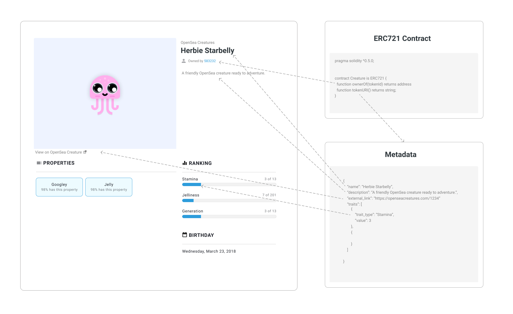
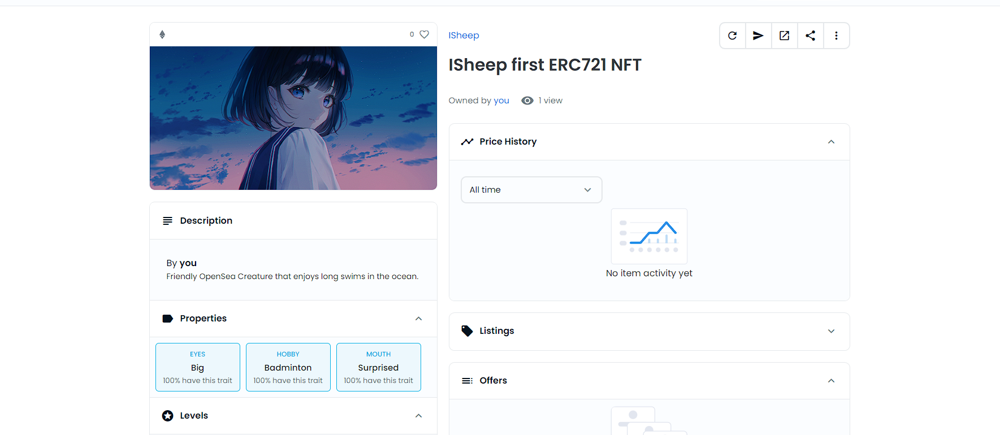
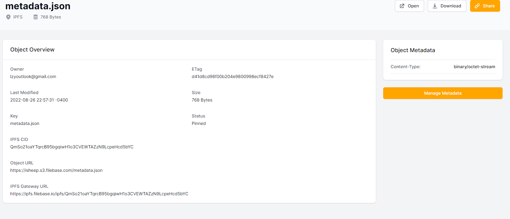
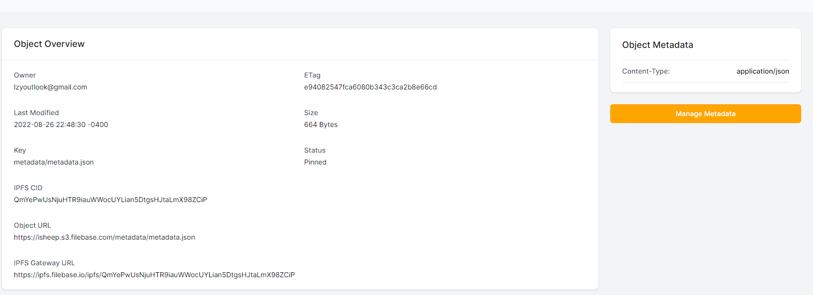

# Sample ERC721 NFT practice

## Introduction

+ 使用 OpenZeppelin [wizard](https://docs.openzeppelin.com/contracts/4.x/wizard) 实现 ERC721 NFT 实例
+ 使用 Remix 部署合约
+ 使用 [filebase](https://filebase.com/) 构建 NFT metadata

## contract
合约部份由 openzeppelin wizard 构建，实现了
1. safemint
2. tokenuri

## metadata
根据 [Opensea doc](https://docs.opensea.io/docs/metadata-standards) 的标准，metadata 就是 NFT 实例的属性，包括了 NFT 的名称、描述、图片地址等等。

## mint

使用`safeMint(address to, string memory uri)`方法，可以将 NFT 实例 mint 给指定的地址。
> uri 是 metadata 的地址，例如 `ipfs://QmYePwUsNjuHTR9iauWWocUYLian5DtgsHJtaLmX98ZCiP`

## 结果
Opensea testnet 画廊能找到测试网的 NFT

## 注意事项
当使用 filebase 上传 NFT metadata 时，请注意：
当上传的 Content-Type 不是 application/json 时，不能由 url 直接打开这个 json 文件。
拖拽上传会出现 Content-Type 为 binary/octet-stream 的情况

这种情况则在 Opensea 画廊展示不了 mint 的NFT
正常情况 👇

