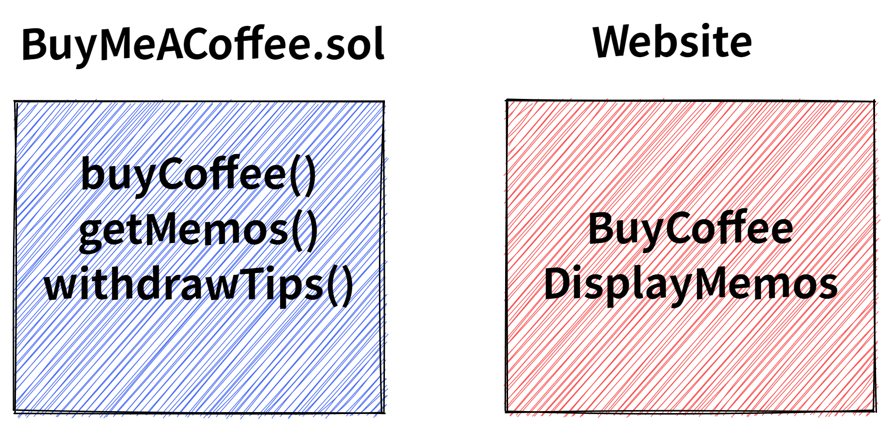

# 制作一个decentralized **爱发电website**

## 简介

爱发电类似 [buy me a coffee](https://www.buymeacoffee.com/isheep?new=1)。本次课程的目标是使用Alchemy、Hardhat、Ethers做一个个人专属的捐赠网站，实现以下功能。

1. 捐赠咖啡（ETH）并留言
2. 提款

## 架构

类似前后端开发

合约部分实现 3 个方法：
1. `buyCoffee()`: 捐赠咖啡
2. `getMemos()`: 获取留言
3. `withdrawTips()`: 提现

