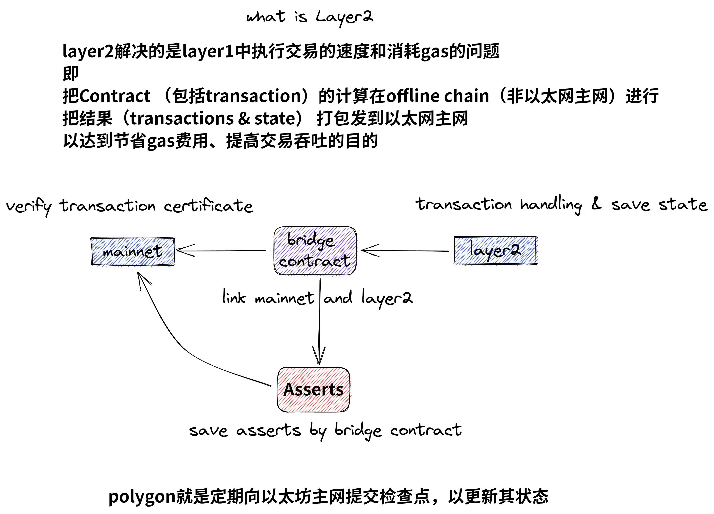
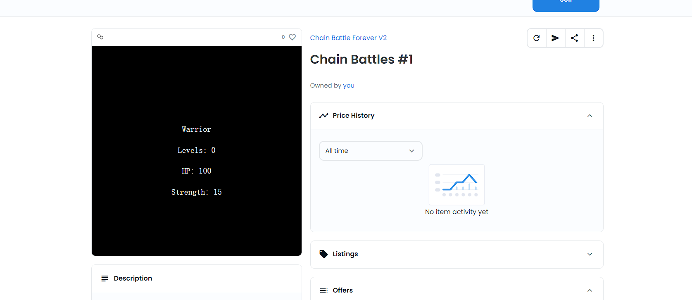
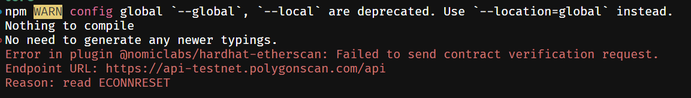
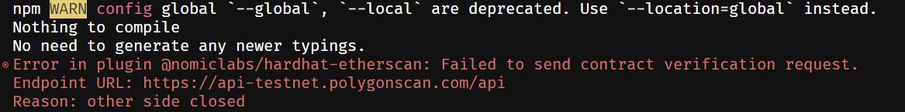
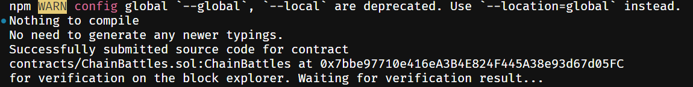

# 构建一个完全上链的 NFT 合约

## 简介

week1 完成的是一个部署在 Ethereum ，只存储了 metadata 访问地址的静态 NFT 。当 metadata 和图片信息也能上链的话，就能制作一个动态的 NFT，适合游戏 NFT。

## Layer2简介


## 步骤

## 成果
address: 0xE8aD93444232FC92515F63eA13A8a6A81ABFcA12

我使用struct新增了一些属性 

[opensea地址](https://testnets.opensea.io/zh-CN/assets/mumbai/0xe8ad93444232fc92515f63ea13a8a6a81abfca12/1)

创建


训练


## 解决 etherscan 插件验证失败的问题

[参考地址](https://issueantenna.com/repo/nomicfoundation/hardhat/issues/2348)

由于终端没有走 proxy 所以在请求 etherscan api 时会报错。不管 proxy 开配置还是全局都会有问题。





ping etherscan 的 api 地址，是不能访问的。

在[域名解析查询网站](https://url5.co/?t=1662217785)查询之后，改用 ping ip 发现是可行的。

解决方法：
1. `npm i undici` 安装 `undici` 依赖并在 `hardhat.config.js` 中配置代理
    ```typescript
    import { ProxyAgent, setGlobalDispatcher } from "undici"
    const proxyAgent = new ProxyAgent('http://127.0.0.1:1080'); // change to yours
    setGlobalDispatcher(proxyAgent);
    ```
2. 修改 hosts 文件，增加 api 的 ip 地址的映射
    ```bash
    104.26.12.96 api-testnet.polygonscan.com
    ```
再进行验证就可以成功了。
